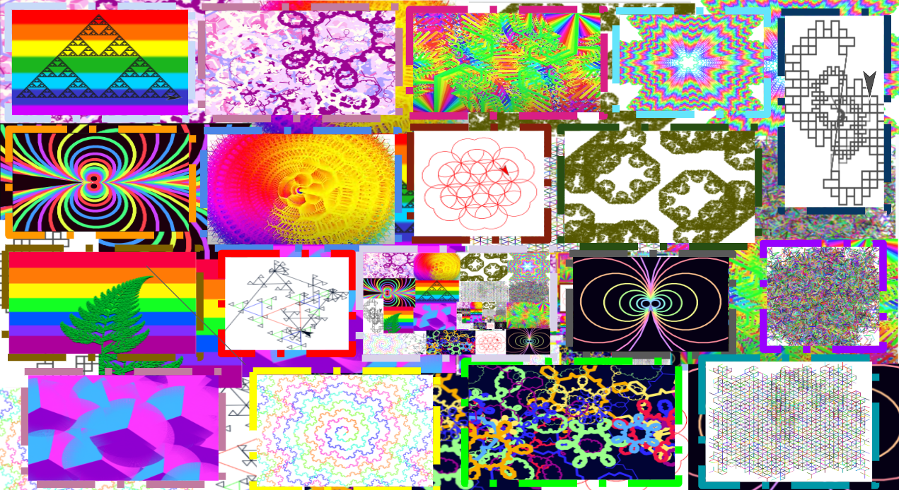

# **BJC 2023 Summer CS Academy**
{: .mb-2 }
UC Berkeley, Summer 2023
{: .mb-2 .fs-6 .text-grey-dk-100 }

{{ site.description }}
{: .mb-2 .fs-5 }

**Instructors:** Caren Thomas, Imen Guechtouli, Sarah Taylor, and Victoria Phelps
{: .fs-4 }

## Contact Information
You may contact us at carenthomas01 (at) gmail.com (Caren), imen (at) berkeley.edu (Imen), 20sgtaylor (at) berkeley.edu (Sarah), and jedi_force (at) berkeley.edu (Victoria).

Please ensure you email *all of us* if you contact us, and follow all the Pre-College program policies regarding emailing staff.

### Final Project Showcase
The final project showcase will be on Thursday, June 29th, 2023, at 3 PM PST via Zoom. Please direct your webpage to the <a href="https://cs10.org/bjc-su23-academy/final-projects/">Final Project Showcase subpage</a> for the Zoom meeting link and to view students' projects.

<!-- ## Course Calendar -->


